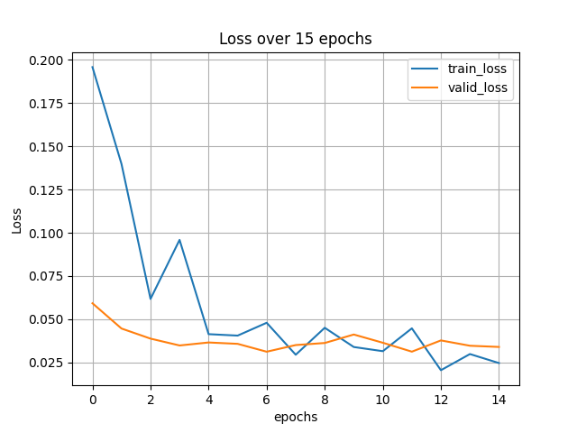
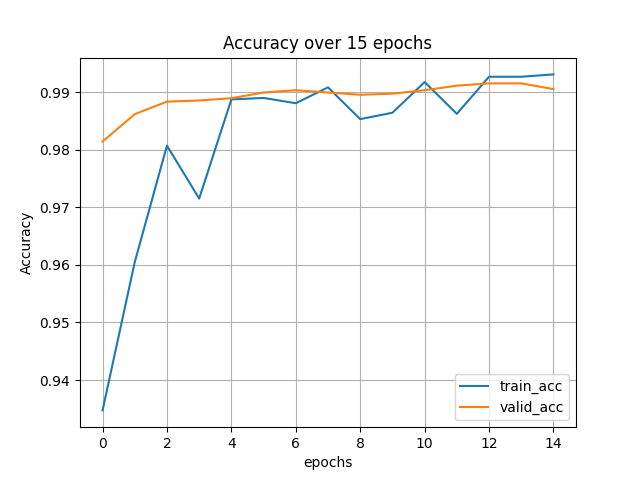

# PyTorch-Lightning-Introduction
__*English follows Japanese*__

本リポジトリは、PyTorch Lightningの使用方法を簡易なexampleソースとともに説明するものであり、  
構成は以下の通りである。  

- Lighitningの基本的な使い方
- callback機能
- logger機能
- 量子化について


## Lighitningの基本的な使い方

本リポジトリ内 Basic_usage_of_lightning.py に基本的なPyTorchLightningの使い方記載している。    
大まかな手順としては、PyTorchと基本的には同じである。

- モデル設計
- デバイスや学習環境の設定
- 学習開始

PyTorchLightningによるモデル学習において、モデル設計が最も大きなステップである。
それに比べ、デバイスや学習環境の設定や学習そのものは非常に簡易な記述で実装することができる。
以下にそれぞれのステップを詳細に説明する。

### モデル設計

モデルの設計は、前述のように非常にPyTorchの記述と似ており、PyTorchでは、`torch.nn.Module`をモデルクラスが継承するのに対し、
PyTorchLightningでは、`pytorch_lightning.LightningModule`を継承する。
モデルの内部で定義すべき項目は以下の通り

```
def __init__(self,args):

def forward(self, x):

def train_dataloader(self):

def val_dataloader(self):

def test_dataloader(self):

def training_step(self, batch, batch_idx):

def test_step(self, batch, batch_nb):

def test_end(self, outputs):

def validation_step(self, batch, batch_idx):

def validation_epoch_end(self, outputs):

def configure_optimizers(self):
```
本スクリプトでは、`def setup(self, stage)`を入れているが、基本的には上記の11ステップを記述しておけば、学習と推論がスムーズに行える。  
`def __init__(self)`では、引数のモデルへの反映のために`args`を加え、`def __init__(self,args)`としている。この`__init__()`と`forward()`は、PyTorchでの記述と同じように設計するだけでよい。  
PyTorchLightningでは、後に紹介するcallback機能や、ログ機能等があり、学習済のモデルに新たにモジュールを用いて変更を加えることがあるので、ベースとなるモデルを独立させ（`torch.nn.Module`による設計で良い）、そのモデルをターゲットとなるモデルに継承させることができる。具体的には、本スクリプトの`LitAutoEncoder`で`self.model=Net()`という風にベースとなるモデル`Net()`を継承することで、モデルを後からカスタマイズできる。  

次に設計で行うことは、データ準備である。これは非常に容易で、`def train_dataloader(self)`, `def val_dataloader(self)`, `def test_dataloader(self)`でそれぞれの用途に合わせたデータローダーを返り値とし設定するだけ。本モデルでは直接、`torch.utils.data.DataLoader`を使用している。  

次に、学習や推論部分の設定を行う。`training_step()`, `test_step()`, `test_end()`, `validation_step()`, `validation_epoch_end()`の設定をしておけば十分であり、`training_step()`, `test_step()`, `validation_step()`では各イテレーションごとのステップ処理を記述している。もしログ機能を用いるのであれば、残したいログをここで設定する。  
`test_end()`, `validation_epoch_end()`では各エポックごとのロス計算等の設定を行う。  

最後に、`configure_optimizers()`ではオプティマイザーの設定を行う。PyTorchでは、ステップごとにオプティマイザーの処理を記述しているが、PyTorchLightningではモデル内で定義できる。
これらの細かな設定により、PyTorchで記述していたような学習や推論のループは不必要になる。


### デバイスや学習環境の設定

PyTorchLightningでは、学習のモデル以外の設定を`pytorch_lightning.Trainer()`で行う。  
最初にモデルの設定を行う。これはPyTorchと同様に、`Model=Net()`のような記述で良い。学習済のモデルからパラメータをロードする際もPyTorchと同様に、`Model.load_state_dict(torch.load(PATH))`が使える。  
モデルの設定が完了すれば、いよいよ学習環境の設定を行う。上述の`pytorch_lightning.Trainer()`ではデバイスや、ログ・コールバック機能の追加、epochの設定が行える。  
詳細は、[PyTorchLightningの公式](https://pytorch-lightning.readthedocs.io/en/stable/common/trainer.html)を参照されたい。


### 学習開始

上記の`pytorch_lightning.Trainer()`を設定したら（本スクリプトでは`trainer=pytorch_lightning.Trainer()`としている）、`学習はtrainer.fit(Model)`とするだけ。  
モデル設計のステップで行った記述のおかげで、PyTorchでまわしていた学習ループが、たったの一行で行えるのがPyTorch Lightningの最も魅力的な点ともいえる。  
また学習したモデルはPyTorchと同様に、`torch.save(Model.state_dict(), PATH)`で保存できる。  
また、一度学習を終えて学習済モデルをロードして推論を行いたい場合は、`python Basic_usage_of_lightning.py --load_model MODEL_PATH`で実行する。
以上がPyTorch Lightningの基本的な使い方である。

## callback機能
PyTorch Lightningは非常にカスタマイズ性が高く、その中でもcheck pointとQuantizationAwareTrainingという機能について紹介する。  

### check point
check pointは、いわば保存機能である。PyTorchでお馴染みの`torch.save(Model.state_dict(), PATH)`にない便利な機能がある。  
check pointの保存とロードの仕方は、それぞれcheck_point_save.py, check_point_load.pyを用いて紹介する。  
今までPyTorchで使っていたモデルファイル（`.pth`,`.pt`）に代替するものが`.ckpt`というファイルである。  

まずはcheck_point_save.pyについて説明する。  
このcheck point機能は`pytorch_lightning.callbacks`からインポートできる `ModelCheckpoint`というモジュールである。
前述の`trainer`の機能に`trainer.save_checkpoint(PATH)`という機能があるが、この機能は学習を終えた最終的な`.ckpt`だけを保存する。  
しかし、`ModelCheckpoint`を用いると、様々なカスタマイズができる。  L.174のように、以下のように設定したmoduleをtrainer設定時に指定するだけで良い。

```
check_point_callbacks=ModelCheckpoint(
        monitor:"valid_loss","valid_accuracy","test_loss", etc.#Quantity to monitor, the last epoch will be saved,
        mode:min,max #min for loss, max for accuracy
        dirpath: #model path to save your trained model,
        filename="{PRAMS1:02d}-{PRAMS2:.2f}",
        save_top_k=3,
        save_weights_only=True, or False #If you want to save only weights of a model, just try True
    )
```
上記のように、filenameをパラメータがわかるように設定すると非常に便利である。また、`monitor`は目的関数のようなもので、どのパラメータを基準に良いモデルを決定するかを定義できる。  
例えば、このようなcallbackを複数作ると、様々なモデルパラメータを選択的に保存できる。  

（使用例）
推論時にlossが低いモデルとaccuracyの高いモデルを残すには、以下のような形で記述すればよい。
```
callback1=ModelCheckpoint(
        monitor:"test_accuracy"
        )
callback2=ModelCheckpoint(
        monitor:"test_loss"
        )
trainer= pytorch_lightning.Trainer(callbacks=[callback1,callback2])       
```

続いてcheck_point_load.pyについて説明する。  
`.ckpt`のロードは非常に簡単であり、以下のようにロードして推論を行う。
```
load_model=Model.load_from_checkpoint(PATH, map_location=torch.device("cpu"),TRIGERS=YOUR_MODEL_TRIGERS)
load_model.eval()
pytorch_lightning.Trainer().test(load_model)
```

`TRIGERS=YOUR_MODEL_TRIGERS`では設計したモデルの`__init__()`の引数を指定すれば良い。注意が必要なのはこれらの引数を`Model(TRIGERS=YOUR_MODEL_TRIGERS).load_from_checkpoint(PATH, map_location=torch.device("cpu"))`のような指定の仕方ができないことである。必ず`.load_from_checkpoint()`内で指定する必要がある。

### QuantizationAwareTraining

本機能は、PyTorchの[Quantization Aware Training](https://pytorch.org/docs/stable/quantization.html#quantization-aware-training)を利用したものである。  
モデルの量子化は、浮動小数点精度よりも低いビット幅（INT8やFLOAT16など）で計算やテンソルの格納を行うことで、推論の高速化とメモリ要件の低減を可能にする。  
Quantization Aware Training（QAT）は、トレーニング中の量子化の効果を模倣したものである。計算は後の量子化の影響が考慮しつつ浮動小数点精度で実行される。重みと活性化関数は、トレーニングが完了したときに、推論のためだけに低精度に量子化される。
該当スクリプトは、quant_with_only_lightning.pyである。  
以下に本機能の設定例を示す。
```
qcb = QuantizationAwareTraining(
    # specification of quant estimation quality
    observer_type="histogram",
    # specify which layers shall be merged together to increase efficiency
    modules_to_fuse=[(f"layer_{i}", f"layer_{i}a") for i in range(2)],
    # make your model compatible with all original input/outputs, in such case the model is wrapped in a shell with entry/exit layers.
    input_compatible=True,
)
```
上記のように、主にこの三つの引数の指定をしていれば問題はない。使い方は前述のcheck pointと同様に`trainer(callbacks=qcb)`と記述する。`modules_to_fuse`の機能も備わっているので、[対応するレイヤ](https://pytorch.org/tutorials/recipes/fuse.html)をここで設定できる。  

以上に述べた以外にもCallbackには様々な機能がある。残りの機能の詳細は`python callbacks_lightning.py`を実行し、`callbacks_info`を参照されたい。

## logger機能

実験を行う際に欠かせないログ機能。PyTorch Lightningでは様々なログ機能が用意されている。詳細は`python loggers_lightning.py`を実行し、`loggers_info`を参照されたい。  
loggerの使い方はcallbackに同じく、`trainer`の引数に`logger=YOURLOGGER`と指定する。また、logger機能の一つ`CSVLogger`をBasic_usage_of_lightning.pyで使用している。MNISTを15エポック学習させ、ログ結果を描画したものが以下の通り。

| Epochs | train_loss / valid_loss | train_acc / valid_acc |
| :-------------: | :-------------: |  :-------------: |
| 0 | 0.195703 / 0.059257 | 0.934743 / 0.981408 |
| 1 | 0.139765 / 0.044663 | 0.960478 / 0.986155 |
| 2 | 0.061755 / 0.038824 | 0.980699 / 0.988331 |
| 3 | 0.095869 / 0.034867 | 0.971507 / 0.988528 |
| 4 | 0.041405 / 0.036595 | 0.988715 / 0.988924 |
| 5 | 0.040567 / 0.035809 | 0.988971 / 0.989913 |
| 6 | 0.047978 / 0.031257 | 0.988051 / 0.990309 |
| 7 | 0.029516 / 0.035104 | 0.990809 / 0.989913 |
| 8 | 0.045085 / 0.036301 | 0.985294 / 0.989517 |
| 9 | 0.033979 / 0.041194 | 0.986400 / 0.989715 |
| 10 | 0.031562 / 0.036442 | 0.991728 / 0.990309 |
| 11 | 0.044761 / 0.031285 | 0.986213 / 0.991100 |
| 12 | 0.020568 / 0.037785 | 0.992647 / 0.991495 |
| 13 | 0.029908 / 0.034707 | 0.992647 / 0.991495 |
| 14 | 0.024699 / 0.034015 | 0.993056 / 0.990506 |
| Graph |  | |


このCSVにログを残しスコアを可視化するloggerの使い方の一例からわかるように、logger機能はカスタマイズ次第で研究開発で非常に役立つ可能性がある。


## 量子化
量子化について、その後の推論の際に、QuantizedCPUで扱えない学習層に注意が必要である。  
（例：MnistではQuantizedCPUで扱えない`torch.nn.functional.log_softmax(x, dim=1)`を`forward()`内で使用するため、除外した。）  
PyTorchLightningのLightningModuleにより設計したモデルを三つの手法により量子化した。  
PyTorch QAT(QuantizationAwareTraining), PyTorch PTQ(Post Training Quantization), PyTorchLightning QAT callbacks(PyTorch QATの機能を利用したLightningの)の3手法である。  
これらの手法で量子化したモデルを用いて、「PyTorchによる推論」と「PyTorch Lightning(Trainer)による推論」を行った。  

結果は以下の表の通りである。

| パターン | 量子化手法 | PyTorchによる推論 | PyTorch Lightning(Trainer)による推論 | モデルの保存 |
| :-------------: | ------------- |  ------------- | ------------- |  ------------- |
| ①  | PyToch QAT  | 推論不可 | 推論不可 | 保存可 |
| ②  | PyToch PTQ  | 推論不可 | 推論不可 | 保存可 |
| ③  | PyTorchLightning QAT callbacks  | 推論可 | 推論可 | 保存可 |


表中の①②③の確認はそれぞれ、quant_lightning_qat.py、quant_lightning_ptq.py、quant_with_only_lightning.pyを用いて確認した。

# Pytorch-Lightning-Introduction (English)

This repository is for explanation of how to use PyTorch Lightning with simple examples

## Basic usage of Lighitning

The Basic_usage_of_lightning.py file in this repository describes the basic usage of PyTorch Lightning.    
The general steps are basically the same as for PyTorch.

- Model design
- Set up the device and learning environment
- Start learning

Model design is the biggest step in model learning with PyTorchLightning.
In comparison, setting up the device and learning environment, and learning itself, can be implemented with a very simple description.
Each of these steps is described in detail below.

### Model Design

As mentioned above, the model design is very similar to that of PyTorch description: in PyTorch, the model class inherits from `torch.nn.Module`, whereas in
PyTorchLightning inherits from `pytorch_lightning.LightningModule`.  
Here are the items that should be defined inside the model

```
def __init__(self,args):

def forward(self, x):

def train_dataloader(self):

def val_dataloader(self):

def test_dataloader(self):

def training_step(self, batch, batch_idx):

def test_step(self, batch, batch_nb):

def test_end(self, outputs):

def validation_step(self, batch, batch_idx):

def validation_epoch_end(self, outputs):

def configure_optimizers(self):
```

In this script, `def setup(self, stage)` is included, but basically, if you write the above 11 steps, training and inference can be done smoothly.  
In `def __init__(self)`, `args` is added to reflect the arguments to the model, and `def __init__(self,args)` is used.
This `__init__()` and `forward()` need only be designed in the same way as in PyTorch.  
In PyTorchLightning, we have callbacks, logging, etc., which we'll introduce later, and we may want to add new modules to the trained model. 
Therefore, we will make the base model independent (just using `torch.nn). It can be inherited by the target model. To be specific, you can customize the model later by inheriting the base model `Net()` with `LitAutoEncoder` of this script as `self.model=Net()`.  

The next thing to do in design is data preparation. This is very easy, just set the data loader for each use as a return value in `def train_dataloader(self)`, `def val_dataloader(self)`, and `def test_dataloader(self)`. In this model, we use `torch.utils.data.DataLoader` directly.  

Next, we set up the training and inference parts. It is enough to set up `training_step()`, `test_step()`, `test_end()`, `validation_step()`, `validation_epoch_end()`, and `training_step()`, It is enough to set `training_step()`, `validation_step()`, and `validation_epoch_end()`, and `test_step()`, `validation_step()`, and `validation_epoch_end()`. If you use the log function, set the log you want to keep here.  
In `test_end()` and `validation_epoch_end()`, you can configure the loss calculation for each epoch.  

Finally, `configure_optimizers()` sets up the optimizers, which are defined in the model in PyTorchLightning as opposed to PyTorch's step-by-step optimizer process.
These fine-grained settings eliminate the need for the training and inference loops that we used to write in PyTorch.


### Setting up the device and learning environment

PyTorchLightning uses `pytorch_lightning.Trainer()` to set up everything about training condition except the model.  
The first step is to set up the model. This can be done in the same way as PyTorch, with `Model=Net()`. When you want to load parameters from a trained model, you can use `Model.load_state_dict(torch.load(PATH))` as in PyTorch.  
After setting up the model, it is time to set up the learning environment. `Trainer()` above allows you to add devices, log callbacks, and epoch settings.  
For more information, please refer to the [PyTorchLIghtning official website](https://pytorch-lightning.readthedocs.io/en/stable/common/trainer.html).

### Start learning

After setting `pytorch_lightning.Trainer()` above (in this script we set `trainer=pytorch_lightning.Trainer()`), all we have to do is `trainer.fit(Model)`.  
One of the most attractive features of PyTorch Lightning is that, thanks to the model design step we discribed former, we can do the training loop we used to do in PyTorch with just one line.  
You can also save the trained model with `torch.save(Model.state_dict(), PATH)`, just like in PyTorch.  
If you want to load a trained model to perform inference once it has been trained, run `python Basic_usage_of_lightning.py --load_model MODEL_PATH`.  
This is the basic usage of PyTorch Lightning.  


## callback functions
PyTorch Lightning is highly customizable, and we'll take a look at some of its features: check point and QuantizationAwareTraining.  

### check point
The check point is a save function, so to speak, and has some useful features that the familiar PyTorch `torch.save(Model.state_dict(), PATH)` does not have.  
We will show you how to save and load check points using check_point_save.py and check_point_load.py respectively.  
The file `.ckpt` is an alternative to the model files (`.pth`, `.pt`) that we have been using in PyTorch.  

First, let's talk about check_point_save.py.  
This function is a module called `ModelCheckpoint` which can be imported from `pytorch_lightning.callbacks`.
The above-mentioned `trainer` has a function `trainer.save_checkpoint(PATH)`, but this function saves only the final `.ckpt` after training.  
However, with `ModelCheckpoint`, various customizations are possible.  As in L.174, you only need to specify a module configured as follows when setting up the trainer.

````
check_point_callbacks=ModelCheckpoint(
        monitor: "valid_loss", "valid_accuracy", "test_loss", etc.#Quantity to monitor, the last epoch will be saved,
        mode:min,max #min for loss, max for accuracy
        dirpath: #model path to save your trained model,
        filename="{PRAMS1:02d}-{PRAMS2:.2f}",
        save_top_k=3,
        save_weights_only=True, or False #If you want to save only weights of a model, just try True
    )
````
As shown above, it is very useful to set filename so that the parameters are known. Also, `monitor` is a kind of objective function, which can define which parameters are used to determine a good model.  
For example, if you make several such callbacks, you can selectively store various model parameters.  

(Example of use)
To keep the models with low loss and high accuracy during inference, we can write the following form.
````
callback1=ModelCheckpoint(
        monitor: "test_accuracy")
        )
callback2=ModelCheckpoint(
        monitor: "test_loss"
        )
trainer= pytorch_lightning.Trainer(callbacks=[callback1,callback2])       
````

The next section describes check_point_load.py.  
Loading `.ckpt` is very simple, load it as follows to do the inference.
```
load_model=Model.load_from_checkpoint(PATH, map_location=torch.device("cpu"),TRIGERS=YOUR_MODEL_TRIGERS)
load_model.eval()
Trainer().test(load_model)
````

In `TRIGERS=YOUR_MODEL_TRIGERS`, you can specify the arguments of `__init__()` for the model you designed. Note that you can't specify these arguments like `Model(TRIGERS=YOUR_MODEL_TRIGERS).load_from_checkpoint(PATH, map_location=torch.device("cpu")))`. You should always specify it in `.load_from_checkpoint()`.

There are many more features of Callback than mentioned above. For details on the rest, run `python callbacks_lightning.py` and look at `callbacks_info`.

### QuantizationAwareTraining

This function is based on PyTorch's [Quantization Aware Training](https://pytorch.org/docs/stable/quantization.html#quantization-aware-training).  
Quantization of the model allows faster inference and reduced memory requirements by computing and storing tensors with bit widths lower than floating point precision (such as INT8 or FLOAT16).  
Quantization Aware Training (QAT) mimics the effects of quantization during training. The computation is performed in floating-point precision, taking into account the effects of later quantization. The weights and activation functions are quantized to a lower precision when training is complete, just for inference.
The corresponding script is quant_with_only_lightning.py.  
An example of the configuration of this function is shown below.
````
qcb = QuantizationAwareTraining(
    # specification of quant estimation quality
    observer_type="histogram",
    # specify which layers shall be merged together to increase efficiency
    modules_to_fuse=[(f "layer_{i}", f "layer_{i}a") for i in range(2)],
    # make your model compatible with all original input/outputs, in such case the model is wrapped in a shell with entry/exit layers.
    input_compatible=True,
)
````
As shown above, there is no problem if you specify these three main arguments. The usage is the same as the above check point, `trainer(callbacks=qcb)`. It also has `modules_to_fuse` function, so you can set [the layer to be fused](https://pytorch.org/tutorials/recipes/fuse.html) here.

## logger functions

Logging is an essential part of running experiments, and PyTorch Lightning provides a variety of logging features. For details, run `python loggers_lightning.py` and refer to `loggers_info`.  
The usage of logger is the same as callback, specify `logger=YOURLOGGER` as an argument of `trainer`. Also, one of the logger functions, `CSVLogger`, is used in Basic_usage_of_lightning.py. 15 epochs of training owith MNIST and the log results are drawn as follows.

| Epochs | train_loss / valid_loss | train_acc / valid_acc |
| :-------------: | :-------------: |  :-------------: |
| 0 | 0.195703 / 0.059257 | 0.934743 / 0.981408 |
| 1 | 0.139765 / 0.044663 | 0.960478 / 0.986155 |
| 2 | 0.061755 / 0.038824 | 0.980699 / 0.988331 |
| 3 | 0.095869 / 0.034867 | 0.971507 / 0.988528 |
| 4 | 0.041405 / 0.036595 | 0.988715 / 0.988924 |
| 5 | 0.040567 / 0.035809 | 0.988971 / 0.989913 |
| 6 | 0.047978 / 0.031257 | 0.988051 / 0.990309 |
| 7 | 0.029516 / 0.035104 | 0.990809 / 0.989913 |
| 8 | 0.045085 / 0.036301 | 0.985294 / 0.989517 |
| 9 | 0.033979 / 0.041194 | 0.986400 / 0.989715 |
| 10 | 0.031562 / 0.036442 | 0.991728 / 0.990309 |
| 11 | 0.044761 / 0.031285 | 0.986213 / 0.991100 |
| 12 | 0.020568 / 0.037785 | 0.992647 / 0.991495 |
| 13 | 0.029908 / 0.034707 | 0.992647 / 0.991495 |
| 14 | 0.024699 / 0.034015 | 0.993056 / 0.990506 |
| Graph |  | |


As you can see from this example of how to use the logger to keep logs in CSV and visualize the scores, the logger function can be very useful in research and development depending on customization.  


## Quantization

For quantization, we need to pay attention to the learning layers that cannot be handled by the 'QuantizedCPU' during the subsequent inference.  
(e.g., Mnist used unavailable layer, `torch.nn.functional.log_softmax(x, dim=1)`, in `forward()`, so we excluded it.)  
The model designed by PyTorchLightning's LightningModule was quantized using three methods.  
The three methods are PyTorch QAT (QuantizationAwareTraining), PyTorch PTQ (Post Training Quantization), and PyTorchLightning QAT callbacks(a Lightning's library that uses the functionality of PyTorch QAT).

Using the models quantized by these methods, we performed "inference with PyTorch" and "inference with PyTorch Lightning (Trainer)".  
The results are shown in the table below.

| Method | Quantization method | Inference with PyTorch | Inference with PyTorch Lightning(Trainer) | Saving model |
| :-------------: | ------------- |  ------------- | ------------- |  ------------- |
| ①  | PyToch QAT  | Unavailable | Unavailable | Available |
| ②  | PyToch PTQ  | Unavailable | Unavailable | Available |
| ③  | PyTorchLightning QAT callbacks  | Available | Available | Available |

①, ②, and ③ in the table were checked using quant_lightning_qat.py, quant_lightning_ptq.py, and quant_with_only_lightning.py, respectively.
